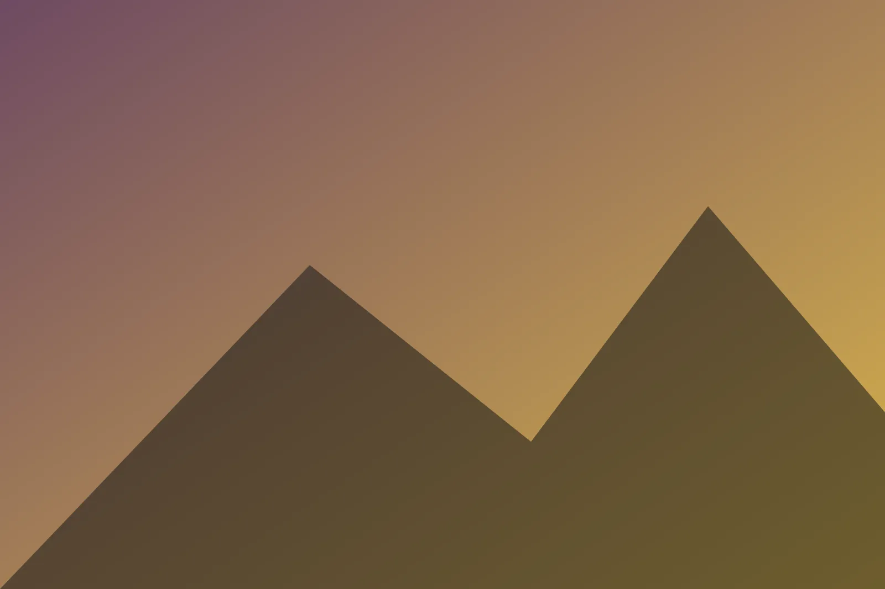
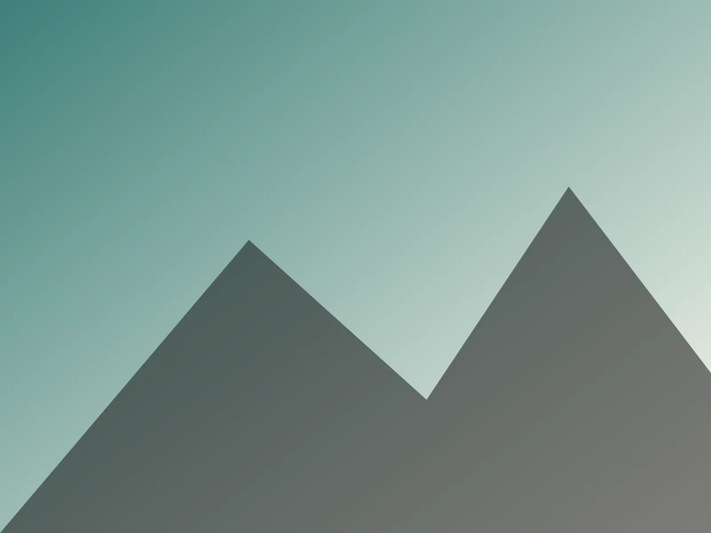
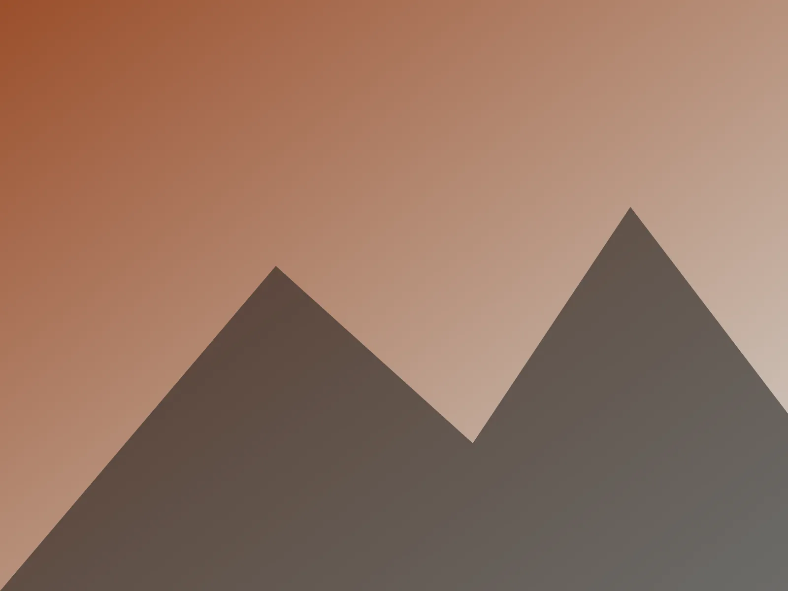
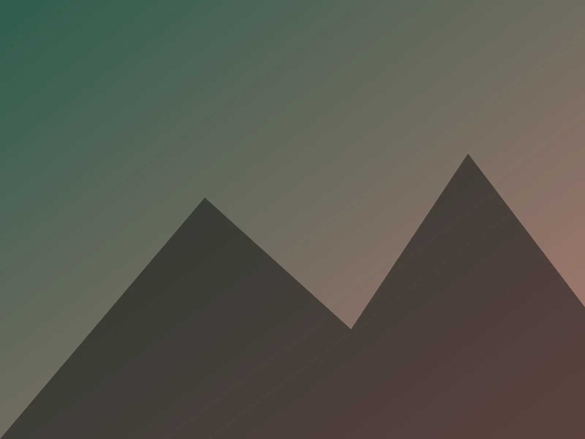

## Day one

Up from Roads End along Bubbs Creek. A lone image renders full width, with its alt text as the caption.

## Day two

Over Glen Pass and down to the lakes.

## Photos

Back at the car by noon on day four.
